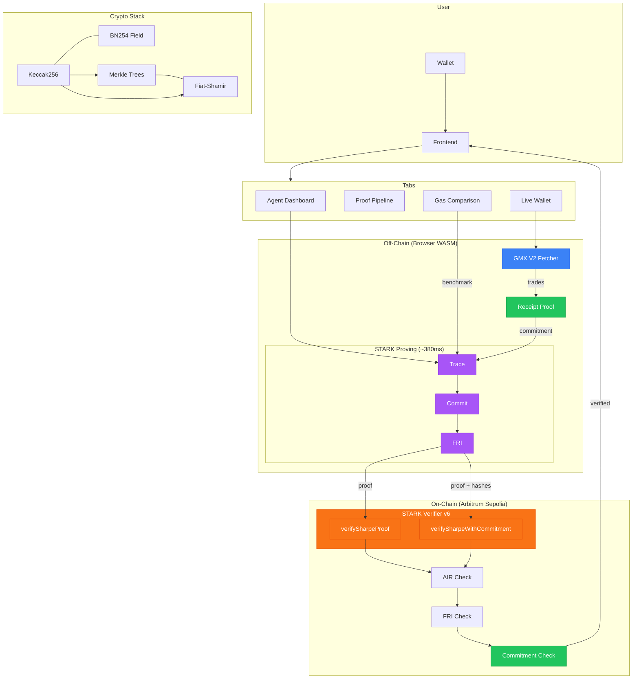
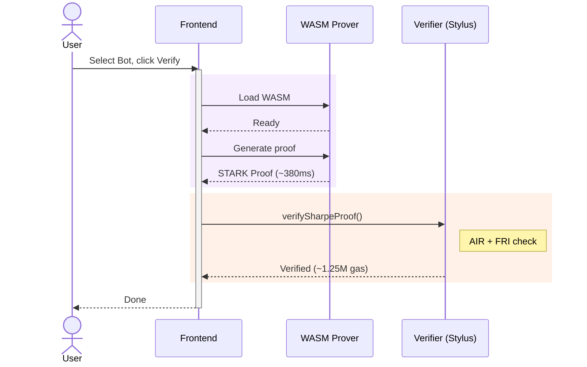
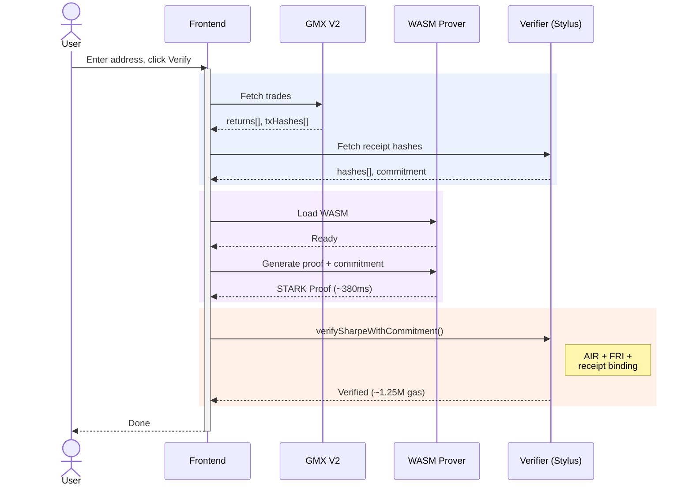

# RealBot — Trustless Trading Agent Verification on Arbitrum Stylus

[](https://opensource.org/licenses/MIT)
[](https://arbitrum.io/)
[](https://www.rust-lang.org/)
[](https://nextjs.org/)

> **STARK-verified Sharpe ratio proofs for DeFi trading agents — no trusted setup, fully on-chain**

Built for **Arbitrum Open House NYC: Online Buildathon** | APAC Mini Hackathon 1st Place

---

## Problem

DeFi trading agents and bots report their own performance. There is no way to verify these claims:

- **Self-reported returns are easy to fake** — anyone can claim a 200% APY
- **Centralized leaderboards require trust** — the platform operator can manipulate rankings
- **No mathematical guarantee** — users have no way to independently verify a Sharpe ratio

RealBot solves this by generating **STARK proofs** of Sharpe ratio computations from real trade data and verifying them **on-chain on Arbitrum Stylus**. The result is a trustless, mathematically verified performance score that no one can forge.

---

## How It Works

1. **Fetch** — Pull real trade history from GMX V2 on Arbitrum One mainnet
2. **Prove** — Generate a STARK proof of the Sharpe ratio computation entirely in the browser (WASM)
3. **Verify** — Submit the proof to the Stylus verifier contract on Arbitrum Sepolia for on-chain verification

### System Architecture



### Bot Verification Flow



### Live Wallet Verification Flow



---

## Key Features

- **STARK-verified Sharpe ratio** — no trusted setup, transparent security, post-quantum ready
- **Real GMX V2 trade data** — pulls actual trades from Arbitrum One mainnet
- **Arbitrum Stylus verifier** — Rust/WASM on-chain contract with native Keccak256 precompile
- **Multi-receipt commitment binding** — binds proof to specific trade receipts via hash chain
- **Browser WASM prover** — proof generation runs entirely client-side, no backend needed
- **~1.25M gas verification** — full STARK proof verified on-chain in a single transaction
- **Live gas benchmark** — run on-chain verification from the Gas Comparison tab and compare measured gas against STARK/SNARK reference data

---

## Demo

> Connect wallet → Enter trader address → View verified Sharpe ratio

<!-- TODO: Add screenshot or GIF -->
<!--  -->

---

## Technical Architecture

### Sharpe Ratio AIR

| Parameter | Value |
|-----------|-------|
| Trace columns | 6 — `[return, return_sq, cum_ret, cum_sq, trade_count, dataset_commitment]` |
| Transition constraints | 5 — cumulative sum, squaring, immutability |
| Boundary constraints | 4 — initial values, final Sharpe equation |
| Composition alphas | 9 |
| LDE blowup | 4x |
| FRI queries | 4 (default) / 20 (full security) |

### Constraint Details

**Transition Constraints:**
- TC0: `cum_ret[i+1] = cum_ret[i] + ret[i+1]`
- TC1: `ret_sq[i] = ret[i] * ret[i]`
- TC2: `cum_sq[i+1] = cum_sq[i] + ret_sq[i+1]`
- TC3: `trade_count` immutability across rows
- TC4: `dataset_commitment` immutability

**Boundary Constraints:**
- BC0: `cum_ret[0] = ret[0]`
- BC1: `cum_sq[0] = ret_sq[0]`
- BC2: `cum_ret[N-1] = total_return`
- BC3: Sharpe equation — `cum_ret² * SCALE - sharpe_sq * (n * cum_sq - cum_ret²) = 0`

### Cryptographic Stack

| Component | Choice |
|-----------|--------|
| Hash | Keccak256 (native Stylus precompile) |
| Field | BN254 scalar field (Montgomery form) |
| Commitment | FRI + Keccak256 Merkle trees |
| Fiat-Shamir | Keccak256-based channel |

---

## Performance Benchmarks

| | STARK (RealBot) | SNARK (SP1 Groth16) | Measured (Live) |
|--|:---:|:---:|:---:|
| **Proof generation** | 380 ms | 18,500 ms | Run from dashboard |
| **Proof size** | 4,864 bytes | 260 bytes | — |
| **On-chain gas** | 1,250,000 | 280,000 | Run from dashboard |
| **Verifier** | Stylus (WASM) | Solidity (Groth16) | Stylus (WASM) |
| **Trusted setup** | None (transparent) | Required (SP1) | None |

> **Live Benchmark:** The Gas Comparison tab lets you run an actual on-chain STARK verification and see the measured gas cost and proof generation time plotted alongside the reference benchmarks. SNARK values are SP1 Groth16 estimates — no SNARK verifier is deployed, so only STARK can be measured live.

**Why STARK?** RealBot uses STARK over SNARK because:
- **No trusted setup** — transparent security assumptions
- **Keccak256 native** — Stylus precompile makes hash-heavy STARK verification efficient on-chain
- **48x faster proof generation** — 380ms vs 18.5s matters for browser UX

### Total Cost of Verification

On-chain gas alone doesn't tell the full story. A fair comparison must include the **off-chain infrastructure cost** required to produce the proof:

| | STARK (RealBot) | SNARK (Groth16) |
|--|:---:|:---:|
| **On-chain gas** | 1.25M | 280K |
| **Proof generation** | 380ms (browser) | 18.5s (server) |
| **Prover hardware** | User's browser (WASM) | SP1 network or high-spec server |
| **Infrastructure cost** | $0 — client-side only | Prover server operation required |
| **Trusted setup** | None | Required (SP1 ceremony) |
| **Trust assumption** | Math only | Math + setup integrity |
| **Post-quantum security** | Yes (hash-based) | No (elliptic curve) |

**SNARK wins on-chain gas by 4.5x**, but:

- **STARK needs zero backend** — proof generation runs entirely in the user's browser via WASM. No prover server to deploy, scale, or pay for. SNARK (Groth16) requires SP1 infrastructure or a dedicated server with 16+ GB RAM running for 18.5 seconds per proof.
- **STARK is 48x faster** — 380ms client-side vs 18.5s server-side. For an interactive UX where the user clicks "Verify" and waits, this is the difference between instant feedback and a loading screen.
- **STARK has no trust dependency** — SNARK requires a trusted setup ceremony. If the setup is compromised, anyone can forge proofs. STARK security relies only on hash function collision resistance.

For RealBot's use case (browser-based, user-initiated, one-off verification), the total cost of STARK is **lower** despite higher on-chain gas — because there is no off-chain infrastructure to build or maintain.

### Current Limitations & Scalability

This is a **hackathon demo** — the full pipeline works end-to-end, but with known constraints:

| Metric | Current (Demo) | Notes |
|--------|:--------------:|-------|
| Max trades | 100 | Capped to keep calldata under MetaMask limits |
| End-to-end time | ~19s | See breakdown below |
| On-chain gas | ~1.25M | Single Arbitrum Sepolia transaction |

**Where does 19 seconds go?**

| Stage | Time | Bottleneck |
|-------|:----:|-----------|
| Trade fetch + Receipt proof | ~5-8s | RPC network I/O |
| WASM prover load | ~1s | One-time init (cached after) |
| **STARK proof generation** | **~380ms** | Actual computation |
| TX send + block confirmation | ~8-10s | Blockchain finality |

The STARK proof itself takes **under 400ms** — the remaining ~18s is network I/O and block confirmation, which applies to any proving system equally.

**100 trades is statistically sufficient** for Sharpe ratio estimation (mean/variance ratio). Academic literature typically uses 30-60 observations as a minimum sample. However, production trading bots may execute thousands of trades, which would require:

- **1,000 trades** — proof gen ~2-3s, gas ~2-3M. Still feasible in a single tx.
- **10,000+ trades** — requires **recursive STARKs** (proving a proof of proofs) or batch aggregation.

**Planned optimizations:**
- Parallel receipt proof fetching (reduce I/O by ~50%)
- WASM preloading on tab entry
- Recursive STARK composition for large trade sets

---

## Quick Start

### Prerequisites

- **Node.js** 18+ / **pnpm**
- **Rust** + cargo (for Stylus contract and prover)
- **Foundry** (for Solidity EvaluationRegistry)

### Run

```bash
git clone https://github.com/2026Arbitriumhackthon/starkverifier.git
cd starkverifier
pnpm install
cp .env.example .env.local
pnpm dev
```

### Test

```bash
# Stylus verifier (88 tests)
cd contracts/stylus && cargo test --features export-abi

# Off-chain prover (54 tests)
cd prover && cargo test

# Solidity registry
cd contracts/solidity && forge test -vvv

# Frontend
pnpm test
```

### Generate a Proof

```bash
cd prover
cargo run --features cli --release -- --bot a --num-queries 4
```

---

## Deployed Contracts (Arbitrum Sepolia)

| Contract | Address | Purpose |
|----------|---------|---------|
| **STARK Verifier v6** | [`0x365344c7057eee248c986e4170e143f0449d943e`](https://sepolia.arbiscan.io/address/0x365344c7057eee248c986e4170e143f0449d943e) | Sharpe ratio STARK verification + commitment binding |
| EvaluationRegistry | TBD | On-chain agent evaluation records |

---

## Project Structure

```
starkverifier/
├── contracts/
│   ├── stylus/                  # On-chain STARK Verifier (Rust → WASM)
│   │   └── src/
│   │       ├── lib.rs           # Entry: verifySharpeProof()
│   │       ├── field.rs         # BN254 field arithmetic (Montgomery)
│   │       ├── merkle.rs        # Keccak256 Merkle verification
│   │       ├── mpt.rs           # MPT proof + commitment binding
│   │       └── stark/           # AIR, FRI, channel, domain, proof
│   └── solidity/                # EvaluationRegistry (Foundry)
├── prover/                      # Off-chain STARK Prover (Rust)
│   ├── src/
│   │   ├── lib.rs               # prove_sharpe()
│   │   ├── sharpe_trace.rs      # Trace generation
│   │   ├── sharpe_compose.rs    # Composition polynomial
│   │   ├── fri.rs               # FRI prover
│   │   ├── channel.rs           # Fiat-Shamir (matches on-chain)
│   │   ├── gmx_fetcher.rs       # GMX V2 trade fetcher
│   │   ├── receipt_proof.rs     # Receipt hash chain
│   │   └── wasm.rs              # WASM bindings (wasm-bindgen)
│   └── pkg/                     # Pre-built WASM package
├── app/                         # Next.js 16 App Router
├── components/                  # React components (shadcn/ui)
│   ├── AgentDashboard.tsx       # Main dashboard with 4 tabs
│   ├── ProofPipeline.tsx        # Step-by-step proof visualization
│   ├── GasComparison.tsx        # STARK vs SNARK benchmark + live verify
│   ├── WalletProver.tsx         # Live wallet proof generation
│   └── AgentCard.tsx            # Bot profile card
├── lib/                         # TypeScript utilities
│   ├── wasm-prover.ts           # WASM prover loader
│   ├── gmx-fetcher.ts           # GMX V2 trade fetcher
│   ├── contracts.ts             # Addresses and ABIs
│   └── benchmark-data.ts        # STARK vs SNARK comparison
├── benchmark/                   # Benchmark tooling (STARK vs SP1)
└── scripts/                     # Build and deploy scripts
```

---

## Tech Stack

| Layer | Technology |
|-------|-----------|
| On-chain verifier | Rust → WASM (Arbitrum Stylus SDK 0.9) |
| On-chain registry | Solidity 0.8.24 (Foundry) |
| Off-chain prover | Rust → WASM (wasm-pack, wasm-bindgen) |
| Hash function | Keccak256 (native Stylus precompile) |
| Field | BN254 scalar field (Montgomery form) |
| Frontend | Next.js 16, React 19, thirdweb v5, shadcn/ui |

---

## Security Model

### Phase A (Current) — Commitment Binding

The prover commits to specific trade data via a **receipt hash chain**. The on-chain verifier checks that the STARK proof is bound to this commitment, preventing proof reuse or data substitution after the fact.

### Roadmap — Full Data Verification

- Encode GMX V2 event decoding inside the STARK circuit
- Verify Merkle Patricia Trie (MPT) membership proofs for Arbitrum receipts
- Achieve fully trustless data binding without any off-chain assumptions

---

## Environment Variables

```env
# Required (Frontend)
NEXT_PUBLIC_THIRDWEB_CLIENT_ID=your_thirdweb_client_id

# Required for contract deployment
PRIVATE_KEY=your_wallet_private_key

# Optional
ARBITRUM_SEPOLIA_RPC_URL=https://sepolia-rollup.arbitrum.io/rpc
ARBISCAN_API_KEY=your_arbiscan_api_key
```

---

## Why Stylus for STARK Verification

STARK proofs are **hash-heavy** — the verifier re-hashes Merkle paths, FRI commitments, and Fiat-Shamir challenges hundreds of times per proof. Arbitrum Stylus compiles Rust to WASM and runs it natively on the Arbitrum chain, giving significant advantages over Solidity/EVM for this workload.

### EVM vs Stylus (WASM) Comparison

| Dimension | EVM (Solidity) | Stylus (WASM) |
|-----------|:--------------:|:-------------:|
| **Register size** | 256-bit stack machine | 64-bit register machine |
| **Loop overhead** | ~8 gas per iteration (JUMP+JUMPDEST) | ~0.1 gas equivalent (native branch) |
| **Memory model** | Linear, 3 gas/byte expansion | Linear, ~0.5 gas/byte |
| **Keccak256** | 30 gas + 6 gas/word (EVM opcode) | **Native precompile** (host I/O) |
| **Arithmetic** | 256-bit only (no native u64) | Native u64 multiply and modular ops |

### Why This Matters for STARK

A single STARK verification call requires:
- **~200+ Keccak256 hashes** — Merkle path verification for each FRI query across all layers
- **~500+ field multiplications** — constraint evaluation, polynomial interpolation, domain operations
- **Tight loops** — FRI fold operations iterate over query data repeatedly

Stylus turns these into native WASM operations with the Keccak256 precompile eliminating the biggest bottleneck. The result: **~1.25M gas** for full STARK verification — feasible in a single Arbitrum transaction.

---

## Contract Deployment

### Stylus Verifier (Rust → WASM)

```bash
cd contracts/stylus

# Validate WASM contract against Stylus constraints
cargo stylus check

# Deploy to Arbitrum Sepolia (requires funded wallet)
cargo stylus deploy --private-key $PRIVATE_KEY
```

### Solidity EvaluationRegistry (Foundry)

```bash
cd contracts/solidity

# Build
forge build

# Deploy via script
forge script script/Deploy.s.sol:Deploy \
  --rpc-url $ARBITRUM_SEPOLIA_RPC_URL \
  --private-key $PRIVATE_KEY \
  --broadcast
```

---

## Proof Interface (Solidity ABI)

The Stylus contract exposes a single verification function. Rust snake_case is auto-converted to Solidity camelCase by the Stylus SDK.

```solidity
function verifySharpeProof(
    uint256[] calldata publicInputs,    // [trade_count, total_return, sharpe_sq_scaled, merkle_root]
    uint256[] calldata commitments,     // [trace_root, comp_root, fri_roots...]
    uint256[] calldata oodValues,       // [6 trace(z), 6 trace(zg), comp(z)] = 13 values
    uint256[] calldata friFinalPoly,    // Final polynomial coefficients
    uint256[] calldata queryValues,     // Flattened query data per FRI layer
    uint256[] calldata queryPaths,      // Flattened Merkle authentication paths
    uint256[] calldata queryMetadata    // [num_queries, num_fri_layers, log_trace_len, indices...]
) external view returns (bool);
```

### Parameter Details

| Parameter | Description |
|-----------|-------------|
| `publicInputs` | Public values the verifier checks against — trade count, total return, scaled Sharpe², and the dataset commitment (receipt Merkle root) |
| `commitments` | Merkle roots for trace, composition, and each FRI layer — binds the prover to specific polynomials |
| `oodValues` | Out-of-domain evaluations at random point `z` — used to check AIR constraints without opening the full polynomial |
| `friFinalPoly` | Coefficients of the final low-degree polynomial after FRI folding — verifier checks degree bound |
| `queryValues` | Decommitted values at randomly sampled positions across all FRI layers |
| `queryPaths` | Merkle authentication paths for each query value — proves membership in committed trees |
| `queryMetadata` | Structural metadata: number of queries, FRI layers, trace length, and the query indices themselves |

---

## Future Plan

### Phase B — MPT Receipt Proof
Verify **Merkle Patricia Trie (MPT) membership proofs** for Arbitrum transaction receipts inside the STARK circuit. This achieves fully trustless data binding: the verifier can confirm that trade data came from a specific L1 batch without any off-chain trust assumption.

### Phase C — In-Circuit Event Decoding
Decode **GMX V2 event logs** (PositionIncrease, PositionDecrease) directly inside the STARK arithmetic circuit. Combined with Phase B, this creates an end-to-end trustless pipeline from raw blockchain state to verified Sharpe ratio.

### Multi-DEX Support
Extend beyond GMX V2 to support trade data from **Uniswap V3**, **dYdX**, and other DEXs on Arbitrum. Each DEX gets an event decoder module that feeds into the same Sharpe ratio AIR.

### EvaluationRegistry Integration
Record verified Sharpe scores in the on-chain **EvaluationRegistry** contract. Enable agent ranking, historical performance tracking, and composable reputation scores that other protocols can query.

### Mainnet Deployment
Migrate from Arbitrum Sepolia to **Arbitrum One mainnet**. Optimize gas costs and conduct security audits before production deployment.

### Additional Metrics
Expand the proof system beyond Sharpe ratio to include:
- **Sortino Ratio** — downside-risk-adjusted return
- **Maximum Drawdown** — largest peak-to-trough decline
- **Calmar Ratio** — return relative to max drawdown
- **Win Rate** — percentage of profitable trades

Each metric gets its own AIR constraint set while sharing the FRI and commitment infrastructure.

---

## Contributing

Contributions are welcome! Please follow the standard fork-and-PR workflow:

1. **Fork** the repository
2. **Create a branch** — `git checkout -b feature/your-feature`
3. **Make your changes** and add tests where applicable
4. **Run tests** — `cargo test --features export-abi` (Stylus) / `cargo test` (prover) / `pnpm test` (frontend)
5. **Push** — `git push origin feature/your-feature`
6. **Open a Pull Request** against `main`

Please open an issue first for major changes to discuss the approach.

---

## References

- [Arbitrum Stylus Documentation](https://docs.arbitrum.io/stylus/gentle-introduction) — Stylus SDK, WASM contract development
- [Arbitrum Stylus SDK (Rust)](https://github.com/OffchainLabs/stylus-sdk-rs) — Rust SDK for Stylus contracts
- [STARKs, Part I: Proofs with Polynomials](https://vitalik.eth.limo/general/2017/11/09/starks_part_1.html) — Vitalik Buterin's STARK explainer
- [ethSTARK Documentation](https://eprint.iacr.org/2021/582) — STARK protocol specification
- [FRI Protocol](https://eccc.weizmann.ac.il/report/2017/134/) — Fast Reed-Solomon Interactive Oracle Proofs of Proximity
- [thirdweb React SDK](https://portal.thirdweb.com/react/v5) — Wallet connection and contract interaction
- [GMX V2 Documentation](https://docs.gmx.io/) — Trade event structure and subgraph API

---

## License

MIT License — see [LICENSE](LICENSE) for details.

---

<p align="center">
  Built for <strong>Arbitrum Open House NYC: Online Buildathon</strong>
</p>
